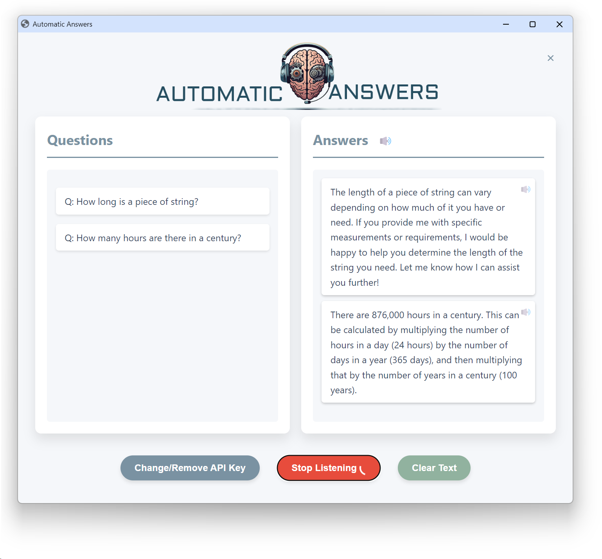

### Copy-paste to setup and run (Windows PowerShell)

```powershell
# Run these in PowerShell from the project folder
Unblock-File .\setup.ps1
Set-ExecutionPolicy -Scope Process Bypass -Force
./setup.ps1
./setup.ps1 -Run
```

### AI Helper



An on-device assistant that listens to your questions, transcribes them, and answers using AI. It shows text answers in a simple web UI and can speak responses aloud.

### Features

- **Hands-free Q&A**: Listens for spoken questions and detects question intent.
- **AI answers (free)**: Uses Groq API with Llama 3 models.
- **Text-to-Speech (free)**: Uses `gTTS` to generate MP3 audio locally.
- **Simple UI**: Built with `Eel`; runs locally in your browser.
- **API key management**: Enter/change/remove key from the UI; stored in `config.json` locally.
- **Per-answer mute + global TTS toggle**: Control audio easily.

### Requirements

- Python 3.9+
- Groq API key (free tier)
- Windows users: `PyAudio` is required for microphone access

### Quickstart (Windows)

1. Open PowerShell in the project folder.
2. Run setup to create a venv and install dependencies:
   ```powershell
   ./setup.ps1
   ```
3. Start the app:
   ```powershell
   ./setup.ps1 -Run
   ```

If `PyAudio` fails to install automatically, download a prebuilt wheel that matches your Python version and architecture from `https://www.lfd.uci.edu/~gohlke/pythonlibs/#pyaudio`, then install it (example):
```powershell
pip install .\Downloads\PyAudio‑0.2.14‑cp311‑cp311‑win_amd64.whl
```

### Manual install (any OS)

```bash
python -m venv .venv
# Windows PowerShell
. .\.venv\Scripts\Activate.ps1
# macOS/Linux
source .venv/bin/activate

pip install -r requirements.txt
python inter_ass.py
```

On first run, the UI will prompt for your Groq API key (`gsk_...`) and save it to `config.json`.

### Using the app

1. Click “Start Listening”.
2. Ask a question clearly; recognized questions appear as `Q: ...`.
3. The assistant generates an answer and, if TTS is enabled, plays audio.
4. Use the speaker icon in the header to toggle global TTS. Use per-answer mute to silence a specific audio clip.
5. Use “Clear Text” to wipe the session. Use “Change/Remove API Key” to update credentials.

### Models and APIs

- Chat: Groq `llama-3.1-8b-instant` (fallback `llama3-8b-8192`)
- TTS: `gTTS` (Google Text-to-Speech library)
- HTTP via `requests` (no vendor SDK required)

### Troubleshooting

- **Microphone not detected / timeouts**: Ensure OS microphone permissions are granted to Python; check the correct input device is selected as default.
- **`PyAudio` install errors (Windows)**: Use the prebuilt wheel method above.
- **No audio output**: Verify system volume and output device. Toggle TTS off/on. Some browsers block autoplay; the app starts playback in response to user actions to avoid blocking.
- **Groq auth errors**: Re-enter your `gsk_...` API key via the UI or set `GROQ_API_KEY` as an environment variable. Network connectivity is required.

### Privacy

- Your API key is stored locally in `config.json` in the project folder.
- Audio is captured from your microphone to generate transcripts; prompts/responses are sent to Groq for completion and `gTTS` for speech audio.

### Contributing

1. Fork the repo and create a feature branch.
2. Make changes and add tests where appropriate.
3. Open a pull request with a clear description.

See GitHub’s guide to [creating a pull request](https://help.github.com/articles/creating-a-pull-request/).

### License

[CDDL-1.0](https://opensource.org/license/cddl-1-0)

### Acknowledgements

- [Groq](https://groq.com/) — Llama 3 chat completions (free tier)
-